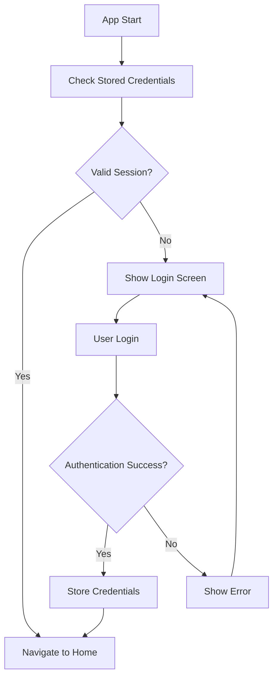
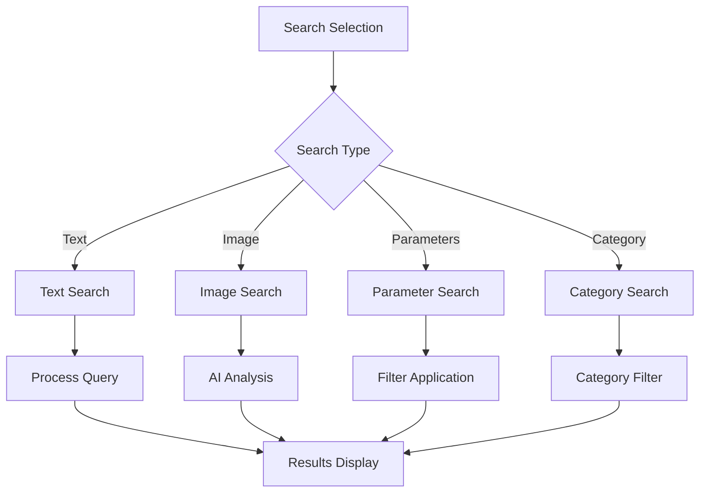

# AIWC Bilingual Animal Identification App - Source Code Documentation

## Table of Contents
1. [Project Overview](#project-overview)
2. [Architecture](#architecture)
3. [Core Components](#core-components)
4. [Data Management](#data-management)
5. [Authentication System](#authentication-system)
6. [User Interface Components](#user-interface-components)
7. [Feature Modules](#feature-modules)
8. [API Integration](#api-integration)
9. [File Structure](#file-structure)
10. [Dependencies](#dependencies)
11. [Development Guidelines](#development-guidelines)

---

## Project Overview

The **AIWC Bilingual Animal Identification App** is a Flutter-based mobile application designed for wildlife conservation and research. It provides forest officers and researchers with tools to identify animals, search through wildlife databases, and access standard operating procedures for wildlife management.

### Key Features
- **Bilingual Support**: English and Tamil language support
- **Animal Identification**: Multi-modal animal identification using text, images, and physical characteristics
- **Search Functionality**: Advanced search capabilities across multiple animal categories
- **Authentication**: Secure user authentication with role-based access
- **Document Management**: Access to SOPs, legal documents, and research materials
- **AI Integration**: Google Generative AI for enhanced identification capabilities

---

## Architecture

### Application Architecture Pattern
The app follows a **layered architecture** with clear separation of concerns:

```
┌─────────────────────────────────────┐
│           Presentation Layer        │
│  (Widgets, Pages, UI Components)    │
├─────────────────────────────────────┤
│           Business Logic Layer      │
│     (Models, State Management)      │
├─────────────────────────────────────┤
│           Data Layer               │
│  (Repositories, Middleware, APIs)   │
├─────────────────────────────────────┤
│           Storage Layer            │
│   (JSON Assets, Secure Storage)     │
└─────────────────────────────────────┘
```

### Key Architectural Decisions
1. **State Management**: Uses Provider pattern and local state management
2. **Data Storage**: Combination of JSON assets and secure storage
3. **API Communication**: RESTful API integration with custom middleware
4. **Navigation**: Flutter's built-in navigation system
5. **Theming**: Custom theme system with FlutterFlow integration

---

## Core Components

### 1. Application Entry Point

#### `main.dart`
```dart
void main() {
  runApp(MyApp());
}

class MyApp extends StatelessWidget {
  @override
  Widget build(BuildContext context) {
    return MaterialApp(
      title: 'Flutter APP',
      theme: ThemeData(primarySwatch: Colors.teal),
      home: const StartWidget(authT: 'Hello First User'),
    );
  }
}
```

**Purpose**: Application bootstrap and configuration
**Key Features**:
- Material Design theme configuration
- Initial route setup
- App-wide configuration

### 2. Start Widget

#### `start_widget.dart`
**Purpose**: Landing page with app branding and navigation
**Key Features**:
- Gradient background design
- User type selection (Admin/User)
- Navigation to authentication flow

**Code Structure**:
```dart
class StartWidget extends StatefulWidget {
  final String authT;
  
  @override
  _StartWidgetState createState() => _StartWidgetState();
}
```

### 3. Authentication Widget

#### `enter_auth_widget.dart`
**Purpose**: Comprehensive authentication system
**Key Features**:
- Login functionality
- User registration
- Password reset
- Secure storage integration
- Auto-login capability

**Key Methods**:
- `login(BuildContext context)`: Handles user authentication
- `register(BuildContext context)`: Manages user registration
- `_checkLoginStatus()`: Verifies existing authentication

**Authentication Flow**:
```dart
Future<void> _checkLoginStatus() async {
  String? isLoggedIn = await secureStorage.read(key: 'isLoggedIn');
  String? username = await secureStorage.read(key: 'username');
  
  if (isLoggedIn == 'true' && username != null) {
    Navigator.of(context).pushReplacement(
      MaterialPageRoute(
        builder: (context) => HomePageWidget(authToken: username),
      ),
    );
  }
}
```

### 4. Home Page Widget

#### `home_page_widget.dart`
**Purpose**: Main dashboard and navigation hub
**Key Features**:
- Bilingual interface switching
- Navigation to different modules
- User session management
- Logout functionality

**Navigation Options**:
- Animal Search
- Identification Tools
- Cases and Logs
- New Query Submission

---

## Data Management

### 1. Models

#### `article_models.dart`
**Purpose**: Data structure definitions for animal and article information

**Key Classes**:
```dart
class Article {
  final String message;
  final List<String> suggestedFilter;
  final List<String> possibleAnimals;
  final Map<String, ArticleDetail> articles;
}

class ArticleDetail {
  final List<String> animalIds;
  final int totalCount;
  final List<ArticleTypeDetail> typeDetails;
}

class ArticleTypeDetail {
  final String characterName;
  final String scale;
  final String value;
  final String id;
  final String animalTitle;
}
```

### 2. Repository Layer

#### `animal_data.dart`
**Purpose**: Data access layer for animal information
**Key Features**:
- Async data fetching
- Error handling
- Data transformation

```dart
class AnimalRepository {
  static Future<ArticleData> fetchData() async {
    final Map<String, dynamic> data = await ArticleMiddleware.fetchAllData();
    return ArticleData(
      suggestedFilters: List<String>.from(data['suggestedFilter']),
      possibleAnimals: List<String>.from(data['PossibleAnimals']),
    );
  }
}
```

### 3. Middleware Layer

#### `animal_middleware.dart`
**Purpose**: API communication and data processing
**Key Features**:
- HTTP request handling
- JSON data processing
- Error management

```dart
class AnimalMiddleware {
  static Future<Article> fetchArticles() async {
    final response = await http.post(
      Uri.parse('https://773c-223-178-83-103.ngrok-free.app/filter-animals'),
      headers: {'Content-Type': 'application/json; charset=UTF-8'},
      body: jsonEncode({}),
    );
    
    if (response.statusCode == 200) {
      return Article.fromJson(jsonDecode(response.body));
    } else {
      throw Exception('Failed to load articles');
    }
  }
}
```

### 4. Global State Management

#### `global.dart`
**Purpose**: Application-wide state management
**Key Features**:
- Singleton pattern implementation
- Language preference storage
- Global variable management

```dart
class GlobalVariables {
  static final GlobalVariables _singleton = GlobalVariables._internal();
  factory GlobalVariables() => _singleton;
  GlobalVariables._internal();
  
  int someGlobalInt = 0; // Language selection (0=English, 1=Tamil)
}
```

---

## Authentication System

### Components
1. **Login System**: Username/password authentication
2. **Registration**: New user registration with approval workflow
3. **Session Management**: Secure token storage and validation
4. **Auto-login**: Persistent authentication state

### Security Features
- **Secure Storage**: Uses `flutter_secure_storage` for credential storage
- **Password Hashing**: Server-side password hashing
- **Session Validation**: Token-based session management
- **Role-based Access**: Different access levels for users and admins

### Authentication Flow


---

## User Interface Components

### 1. Flutter Flow Theme System

#### `flutter_flow_theme.dart`
**Purpose**: Comprehensive theming system
**Key Features**:
- Color palette management
- Typography definitions
- Component styling
- Theme switching support

### 2. Custom Widgets

#### Navigation Components
- **SilverAppBarWidget**: Custom app bar with gradient background
- **SearchBarWidget**: Reusable search input component

#### Input Components
- **DynamicButtonField**: Dynamic parameter selection interface
- **FilterDetailsBottomSheet**: Advanced filtering options

#### Display Components
- **ImageInput**: Camera and gallery integration
- **PromptInput**: AI text input interface

### 3. Page Components

#### Search and Identification
- **SearchSelection**: Main search interface
- **AnimalSearch**: Animal-specific search functionality
- **SpeciesSelect**: Species selection interface
- **Identification**: Multi-parameter identification system

#### Content Pages
- **ArticleDetailsPage**: Detailed article display
- **SearchResultsPage**: Search results presentation
- **ArticleSelectionPage**: Article category selection

---

## Feature Modules

### 1. Animal Identification System

#### `Identification.dart`
**Purpose**: Multi-parameter animal identification
**Key Features**:
- Dynamic parameter selection
- Visual characteristic matching
- Progressive identification workflow

#### `Dynamicinput.dart`
**Purpose**: Dynamic input system for animal characteristics
**Key Features**:
- Customizable parameter sets
- Real-time suggestion system
- Multi-tab interface

**Parameter Categories**:
```dart
Map<String, Map<String, List<String>>> bodyPartParameters = {
  'Horn': {
    'description': ['long', 'ringed', 'resemble corkscrews'],
    'measurement': ['measure 35–75 cm']
  },
  'Skin': {
    'color': ['dark brown', 'white underside', 'reddish yellow'],
    'details': ['haired', 'tawny yellow or gold']
  },
  // ... more parameters
};
```

### 2. Search System

#### Advanced Search Capabilities
- **Text-based Search**: Keyword and description matching
- **Image-based Search**: Visual identification using AI
- **Parameter-based Search**: Characteristic-based filtering
- **Category-based Search**: Taxonomic classification search

#### Search Flow


### 3. Document Management

#### `cases_and_logs.dart`
**Purpose**: Document and SOP management system
**Key Features**:
- PDF document viewer
- Document categorization
- Online document access
- Offline document caching

**Document Categories**:
- Standard Operating Procedures (SOPs)
- Legal documents
- Research materials
- Training resources

### 4. AI Integration

#### Google Generative AI Integration
**Components**:
- **Text Analysis**: Natural language processing for animal descriptions
- **Image Recognition**: Visual animal identification
- **Query Processing**: Intelligent search query interpretation

#### `ai_text.dart`
```dart
class PromptInput extends StatefulWidget {
  final String? apiKey;
  
  Future<void> _generateResponse() async {
    final model = GenerativeModel(model: 'gemini-1.5-flash', apiKey: apiKey);
    final content = [Content.text(userInput)];
    final response = await model.generateContent(content);
    // Process response
  }
}
```

---

## API Integration

### Backend Communication
- **Base URL**: `https://773c-223-178-83-103.ngrok-free.app`
- **Authentication**: Token-based authentication
- **Data Format**: JSON request/response
- **Error Handling**: Comprehensive error management

### API Endpoints
1. **Authentication**:
   - `POST /login` - User login
   - `POST /register` - User registration

2. **Animal Data**:
   - `POST /filter-animals` - Animal filtering and search
   - `GET /animal-details` - Detailed animal information

3. **Document Management**:
   - `GET /documents` - Document listing
   - `GET /document/{id}` - Document download

### Request/Response Structure
```dart
// Example API request
final response = await http.post(
  Uri.parse('${baseUrl}/filter-animals'),
  headers: {
    'Content-Type': 'application/json; charset=UTF-8',
    'Authorization': 'Bearer $token',
  },
  body: jsonEncode({
    'filters': selectedFilters,
    'searchTerm': searchQuery,
  }),
);
```

---

## File Structure

```
lib/
├── main.dart                    # Application entry point
├── global.dart                  # Global state management
├── start_widget.dart           # Landing page
├── enter_auth_widget.dart      # Authentication system
├── home_page_widget.dart       # Main dashboard
├── Identification.dart         # Identification system
├── Dynamicinput.dart          # Dynamic input components
├── cases_and_logs.dart        # Document management
├── animallist.dart            # Animal listing utilities
├── dynamicwidgets.dart        # Dynamic UI components
├── models/                    # Data models
│   └── article_models.dart
├── repositories/              # Data access layer
│   └── animal_data.dart
├── middleware/                # API communication
│   └── animal_middleware.dart
├── pages/                     # Application pages
│   ├── search_selection.dart
│   ├── animal_search.dart
│   ├── search_results_page.dart
│   ├── article_details_page.dart
│   ├── article_selection_page.dart
│   ├── species_select.dart
│   ├── pugmarks_page.dart
│   ├── scat_pellet_dung_page.dart
│   └── ...
├── widgets/                   # Reusable UI components
│   ├── NewQueryPage.dart
│   ├── ai_text.dart
│   ├── Image_check.dart
│   ├── filter_details_bottom_sheet.dart
│   ├── search_bar_widget.dart
│   └── silver_app_bar_widget.dart
├── flutter_flow/             # UI framework components
│   ├── flutter_flow_theme.dart
│   ├── flutter_flow_widgets.dart
│   ├── flutter_flow_util.dart
│   └── ...
└── translation/              # Internationalization
```

---

## Dependencies

### Core Dependencies
```yaml
dependencies:
  flutter: sdk: flutter
  cupertino_icons: ^1.0.2
  
  # UI and Animation
  flutter_animate: ^4.3.0
  page_transition: ^2.1.0
  google_fonts: 6.1.0
  font_awesome_flutter: ^10.6.0
  
  # State Management
  provider: ^6.1.1
  
  # Storage and Data
  shared_preferences: ^2.0.0
  flutter_secure_storage: ^9.0.0
  http: ^0.13.0
  json_path: ^0.7.0
  
  # Media and Files
  flutter_pdfview: ^1.3.2
  image_picker: ^0.8.0
  camera: ^0.10.0
  
  # AI Integration
  google_generative_ai: ^0.2.0
  
  # Utilities
  timeago: ^3.6.0
  url_launcher: ^6.0.0
  mime_type: ^1.0.0
```

### Development Dependencies
```yaml
dev_dependencies:
  flutter_test: sdk: flutter
  flutter_lints: ^2.0.0
```

---

## Development Guidelines

### Code Organization
1. **Separation of Concerns**: Clear separation between UI, business logic, and data layers
2. **Reusable Components**: Create reusable widgets for common UI patterns
3. **Error Handling**: Comprehensive error handling at all levels
4. **Documentation**: Inline documentation for complex logic

### Naming Conventions
- **Files**: snake_case for file names
- **Classes**: PascalCase for class names
- **Variables**: camelCase for variable names
- **Constants**: UPPER_SNAKE_CASE for constants

### State Management Best Practices
1. **Local State**: Use `setState()` for simple, local state changes
2. **Shared State**: Use Provider or similar for shared state
3. **Persistent State**: Use secure storage for sensitive data
4. **Global State**: Use singleton pattern for app-wide state

### Testing Strategy
1. **Unit Tests**: Test individual functions and methods
2. **Widget Tests**: Test UI components and interactions
3. **Integration Tests**: Test complete user workflows
4. **API Tests**: Test API communication and data handling

### Performance Considerations
1. **Lazy Loading**: Implement lazy loading for large datasets
2. **Image Optimization**: Optimize image loading and caching
3. **Memory Management**: Proper disposal of resources
4. **Network Optimization**: Efficient API calls and caching

### Security Best Practices
1. **Secure Storage**: Use secure storage for sensitive data
2. **Input Validation**: Validate all user inputs
3. **API Security**: Implement proper authentication and authorization
4. **Data Encryption**: Encrypt sensitive data transmission

---

## Conclusion

The AIWC Bilingual Animal Identification App is a comprehensive wildlife management tool built with Flutter. Its modular architecture, robust authentication system, and advanced search capabilities make it suitable for professional wildlife conservation work. The app's bilingual support and AI integration enhance its usability for diverse user groups in wildlife research and management.

The codebase follows modern Flutter development practices with clear separation of concerns, comprehensive error handling, and maintainable code structure. The integration of multiple data sources, AI capabilities, and document management systems provides a complete solution for wildlife identification and management needs. 
